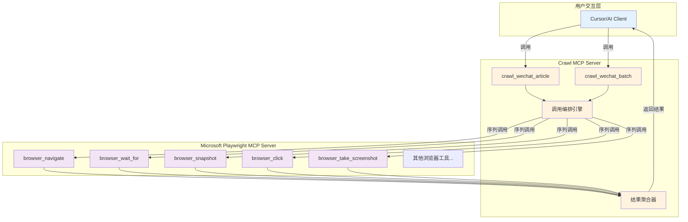
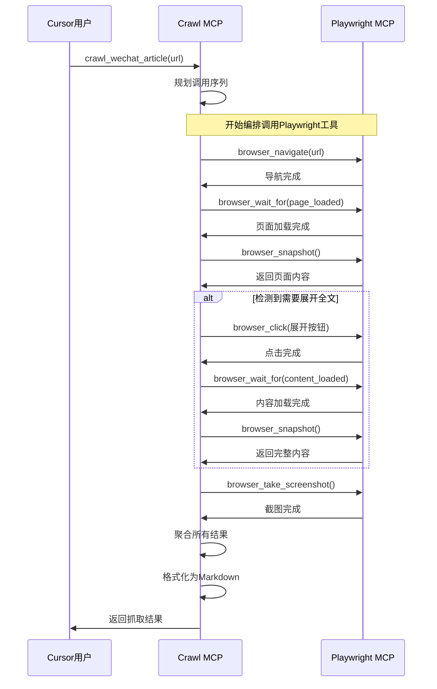

# 微信公众号文章抓取 MCP 服务器开发 PRD

## 1. 项目背景

### 1.1 项目概述
开发一个专门的 Crawl MCP 服务器，通过**调用编排**的方式使用 [microsoft/playwright-mcp](https://github.com/microsoft/playwright-mcp) 的工具。利用 Cursor 支持连续执行 25 个工具调用的能力，让 Crawl MCP 能够智能调用 Playwright MCP 的多个工具，将复杂的浏览器操作序列编排成简单的文章抓取命令。

### 1.2 技术背景
- **MCP 协议**: 基于 Model Context Protocol 开发新的独立服务器
- **工具调用链**: Crawl MCP → 调用 → Playwright MCP 的各种工具
- **编排设计**: 通过智能编排多个 Playwright 工具调用来完成抓取任务
- **工具协作**: 一个 MCP 可以调用另一个 MCP 的工具（MCP-to-MCP 调用）

### 1.3 核心价值
- **智能编排**: 自动规划和执行复杂的工具调用序列
- **专业化**: 专门针对微信公众号文章抓取优化的工具组合
- **解耦设计**: Crawl MCP 和 Playwright MCP 独立部署，松耦合
- **可复用**: 可以调用任何可用的 Playwright MCP 工具

## 2. 产品目标

### 2.1 主要目标
1. **编排目标**: 智能编排 microsoft/playwright-mcp 的多个工具调用
2. **专业化目标**: 专门优化微信公众号文章抓取的工具调用序列
3. **效率目标**: 单篇文章抓取时间 < 30秒，成功率 > 95%
4. **易用性目标**: 用户只需一条命令，系统自动调用多个 Playwright 工具

### 2.2 收益指标
- **调用简化**: 从手动多步骤工具调用简化为单条高级命令
- **序列优化**: 针对微信公众号优化的工具调用序列
- **协作增强**: 展示 MCP 生态中不同服务器间的协作能力

## 3. 用户故事与需求

### 3.1 核心用户群体
- **Cursor 用户**: 使用 Cursor 编辑器和 MCP 生态的开发者
- **内容创作者**: 需要高效收集微信公众号内容的创作者
- **AI 应用开发者**: 需要在自己的应用中集成文章抓取功能的开发者
- **研究人员**: 需要批量收集和分析微信公众号文章的研究者

### 3.2 用户故事
```
作为一个 Cursor 用户
我希望能够使用简单的命令 "请使用crawl mcp 抓取: [URL]"
以便我能够一键完成整个复杂的抓取流程

作为一个 AI 应用开发者
我希望能够在我的应用中调用 crawl mcp 服务
以便我的用户能够无缝集成文章抓取功能

作为一个内容研究者
我希望抓取的文章具有标准化的格式和元数据
以便我能够进行后续的分析和处理
```

### 3.3 MCP 工具设计

#### 3.3.1 核心工具
- **crawl_wechat_article**: 抓取单篇微信公众号文章
- **crawl_wechat_batch**: 批量抓取多篇文章
- **crawl_get_status**: 查询抓取任务状态
- **crawl_configure**: 配置抓取参数

#### 3.3.2 内部实现功能
- **自动页面导航**: 自动调用 browser_navigate
- **智能等待**: 自动调用 browser_wait_for 等待页面加载
- **内容提取**: 自动调用 browser_snapshot 获取页面内容
- **展开处理**: 自动检测并点击"展开全文"按钮
- **错误重试**: 自动处理抓取失败并重试
- **内容清洗**: 自动清理广告和无关内容
- **格式转换**: 自动转换为 Markdown 格式

## 4. 技术架构设计

### 4.1 MCP 调用编排架构



### 4.2 核心组件设计

#### 4.2.1 调用序列规划器 (Call Sequence Planner)
负责规划和生成 Playwright MCP 工具调用序列：
- **序列设计**: 为不同抓取场景设计最优的工具调用序列
- **条件分支**: 根据页面状态决定是否需要额外的工具调用
- **错误处理**: 在调用失败时重新规划后续调用
- **性能优化**: 最小化不必要的工具调用

#### 4.2.2 工具调用编排器 (Tool Call Orchestrator)
执行具体的 MCP 工具调用：
- **调用管理**: 按序列依次调用 Playwright MCP 工具
- **状态维护**: 在多个调用间维护页面状态
- **参数传递**: 将前一个调用的结果传递给下一个调用
- **并发控制**: 在批量处理时控制并发调用数量

#### 4.2.3 结果聚合器 (Result Aggregator)
处理和整合多个工具调用的结果：
- **内容整合**: 将多次 browser_snapshot 的结果整合
- **格式转换**: 转换为用户需要的最终格式
- **质量检查**: 验证抓取内容的完整性
- **文件保存**: 保存最终处理的结果

#### 4.2.4 配置管理器 (Configuration Manager)
管理调用策略和参数：
- **序列模板**: 预定义的工具调用序列模板
- **参数配置**: 各个工具调用的参数设置
- **重试策略**: 失败重试的配置
- **输出设置**: 结果输出格式和路径配置

### 4.3 依赖关系

#### 4.3.1 外部依赖关系
- **microsoft/playwright-mcp**: 被调用的目标 MCP 服务器
- **MCP SDK**: MCP 协议实现和客户端
- **Cursor**: 支持 MCP-to-MCP 调用的环境

#### 4.3.2 调用关系
- **独立部署**: Crawl MCP 和 Playwright MCP 独立运行
- **运行时调用**: Crawl MCP 在运行时调用 Playwright MCP 工具
- **无直接依赖**: 两个 MCP 服务器没有代码级依赖
- **协议通信**: 通过 MCP 协议进行工具调用通信

## 5. MCP 工具定义

### 5.1 核心工具接口

#### 5.1.1 crawl_wechat_article

```json
{
  "name": "crawl_wechat_article",
  "description": "抓取单篇微信公众号文章",
  "inputSchema": {
    "type": "object",
    "properties": {
      "url": {
        "type": "string",
        "description": "微信公众号文章URL"
      },
      "output_format": {
        "type": "string",
        "enum": ["markdown", "json", "html"],
        "default": "markdown",
        "description": "输出格式"
      },
      "save_images": {
        "type": "boolean",
        "default": true,
        "description": "是否下载并保存图片"
      },
      "clean_content": {
        "type": "boolean",
        "default": true,
        "description": "是否清理广告等无关内容"
      }
    },
    "required": ["url"]
  }
}
```

#### 5.1.2 crawl_wechat_batch

```json
{
  "name": "crawl_wechat_batch",
  "description": "批量抓取多篇微信公众号文章",
  "inputSchema": {
    "type": "object",
    "properties": {
      "urls": {
        "type": "array",
        "items": {"type": "string"},
        "description": "文章URL列表"
      },
      "concurrent_limit": {
        "type": "integer",
        "default": 3,
        "description": "并发抓取数量限制"
      },
      "delay_seconds": {
        "type": "integer",
        "default": 2,
        "description": "每次抓取间隔秒数"
      }
    },
    "required": ["urls"]
  }
}
```

### 5.2 MCP 工具调用编排时序



### 5.3 用户使用示例

#### 原始方式 vs 封装后方式

**原始复杂方式**:
```
用户: "请帮我抓取这篇微信文章，先导航到页面，等待加载，获取内容，如果有展开按钮就点击，然后重新获取内容，最后清理格式保存为Markdown: https://mp.weixin.qq.com/s/xxx"
```

**封装后简化方式**:
```
用户: "请使用 crawl mcp 抓取: https://mp.weixin.qq.com/s/xxx"
```

#### 批量抓取示例

```
用户: "请使用 crawl mcp 批量抓取这些文章: 
- https://mp.weixin.qq.com/s/article1
- https://mp.weixin.qq.com/s/article2
- https://mp.weixin.qq.com/s/article3"
```

### 5.3 典型用户交互示例

#### 5.3.1 基础抓取对话
```
用户: "请帮我抓取这篇微信公众号文章的内容，保存为 Markdown 格式: https://mp.weixin.qq.com/s/example"

AI Agent: 
好的，我来帮你抓取这篇文章。让我使用浏览器工具来完成这个任务。

[调用 browser_navigate]
正在导航到文章页面...

[调用 browser_wait_for] 
等待页面加载完成...

[调用 browser_snapshot]
获取页面内容...

[AI 分析内容]
我已经成功获取了文章内容。文章标题是："xxx"，作者是："xxx"。

[保存文件]
我已经将文章内容保存为 `wechat_article_20241201.md` 文件在你的项目目录中。

内容包括：
- 文章标题和作者信息
- 完整的正文内容
- 清理了广告和无关信息
- 转换为了标准的 Markdown 格式

你需要我对内容做任何调整吗？
```

#### 5.3.2 批量抓取对话
```
用户: "我有几篇文章想要批量抓取，链接如下：
1. https://mp.weixin.qq.com/s/aaa
2. https://mp.weixin.qq.com/s/bbb  
3. https://mp.weixin.qq.com/s/ccc"

AI Agent:
好的，我来帮你批量抓取这3篇文章。我会依次处理每篇文章。

正在处理第1篇文章...
[执行抓取流程]
✓ 第1篇文章已保存为 `article_1_title.md`

正在处理第2篇文章...
[执行抓取流程]  
✓ 第2篇文章已保存为 `article_2_title.md`

正在处理第3篇文章...
[执行抓取流程]
✓ 第3篇文章已保存为 `article_3_title.md`

批量抓取完成！所有文章都已保存在项目的 `wechat_articles/` 目录中。
```

## 6. 文件输出设计

### 6.1 输出文件结构

由于基于 Cursor MCP 工具的方案无需数据库，所有内容直接保存为文件：

```
project_root/
├── wechat_articles/           # 抓取的文章目录
│   ├── 2024-12-01/           # 按日期分组
│   │   ├── article_1.md      # 文章1 Markdown文件
│   │   ├── article_2.md      # 文章2 Markdown文件
│   │   └── images/           # 图片目录
│   │       ├── article_1_img1.jpg
│   │       └── article_2_img1.png
│   ├── index.md              # 文章索引文件
│   └── crawl_log.json        # 抓取记录日志
```

### 6.2 Markdown 文件格式

```markdown
---
title: "文章标题"
author: "作者名称" 
account: "公众号名称"
url: "https://mp.weixin.qq.com/s/xxx"
crawl_date: "2024-12-01 10:30:00"
word_count: 2500
---

# 文章标题

> **作者**: 作者名称  
> **公众号**: 公众号名称  
> **发布时间**: 2024-11-30  
> **原文链接**: [查看原文](https://mp.weixin.qq.com/s/xxx)

## 正文内容开始

这里是文章的正文内容...


更多内容...

---

*本文通过 Cursor MCP Playwright 工具自动抓取*
```

### 6.3 抓取记录格式

```json
{
  "crawl_sessions": [
    {
      "session_id": "20241201_103000",
      "timestamp": "2024-12-01T10:30:00Z",
      "articles": [
        {
          "url": "https://mp.weixin.qq.com/s/xxx",
          "title": "文章标题",
          "author": "作者名称",
          "account": "公众号名称",
          "file_path": "./2024-12-01/article_1.md",
          "status": "success",
          "word_count": 2500,
          "images_count": 3,
          "crawl_duration": "45s"
        }
      ],
      "total_articles": 1,
      "success_count": 1,
      "failed_count": 0
    }
  ]
}
```

## 7. 常用指令模板

### 7.1 基础抓取指令

#### 7.1.1 单篇文章抓取
```
"请帮我抓取这篇微信公众号文章: [URL]"
"抓取这个链接的内容并保存为 Markdown: [URL]"
"获取这篇文章的完整内容: [URL]"
```

#### 7.1.2 指定输出格式
```
"抓取这篇文章并保存为 article.md 文件: [URL]"
"获取文章内容，保存在 /docs 目录下: [URL]"
"抓取文章，文件名用文章标题命名: [URL]"
```

#### 7.1.3 批量抓取
```
"帮我批量抓取这些文章: 
1. [URL1]
2. [URL2] 
3. [URL3]"

"抓取以下链接的所有文章:
- [URL1]
- [URL2]"
```

### 7.2 高级需求指令

#### 7.2.1 内容处理要求
```
"抓取文章时请去除广告内容: [URL]"
"只保留正文，去掉作者介绍和推广信息: [URL]"
"抓取文章并提取出其中的要点总结: [URL]"
```

#### 7.2.2 特殊处理指令
```
"如果文章需要展开全文，请自动点击展开: [URL]"
"抓取文章时如果遇到验证，请截图让我处理: [URL]"
"抓取图片并转换为本地链接: [URL]"
```

### 7.3 工具组合使用策略

#### 7.3.1 标准抓取流程
1. **browser_navigate** - 导航到文章页面
2. **browser_wait_for** - 等待页面加载完成
3. **browser_take_screenshot** - 截图验证页面状态
4. **browser_snapshot** - 获取页面内容
5. 如需要：**browser_click** - 点击展开全文
6. 重新 **browser_snapshot** - 获取完整内容
7. AI 分析和清理内容
8. 保存为 Markdown 文件

#### 7.3.2 错误处理流程
1. 检测到反爬虫机制时的处理策略
2. 页面加载失败时的重试机制
3. 内容提取失败时的备用方案

### 7.4 常见问题处理

#### 7.4.1 反爬虫处理
- 使用 `browser_wait_for` 增加等待时间
- 使用 `browser_click` 模拟人工操作
- 使用 `browser_scroll` 模拟浏览行为

#### 7.4.2 内容不完整处理
- 检查是否有"展开全文"按钮
- 检查是否有分页内容
- 检查是否有动态加载内容

## 8. 开发实施计划

### 8.1 技术选型

#### 8.1.1 开发语言
推荐使用 **Node.js/TypeScript** 或 **Python**：
- Node.js: 与 microsoft/playwright-mcp 技术栈一致
- Python: MCP 生态支持良好，开发便利

#### 8.1.2 核心依赖
```json
{
  "dependencies": {
    "@modelcontextprotocol/sdk": "latest",
    "cheerio": "^1.0.0",
    "turndown": "^7.1.2"
  }
}
```

**注意**: 不需要直接依赖 `@playwright/mcp`，因为是通过 MCP 协议调用，而不是代码级依赖。

### 8.2 开发阶段

#### Phase 1: 基础架构 (Week 1)
- [ ] 搭建 MCP 服务器基础框架
- [ ] 集成 microsoft/playwright-mcp 客户端
- [ ] 实现基础的工具注册和请求处理
- [ ] 编写简单的单元测试

#### Phase 2: 核心功能 (Week 2)
- [ ] 实现 `crawl_wechat_article` 工具
- [ ] 开发 MCP 工具调用编排逻辑
- [ ] 实现 Playwright MCP 工具调用序列
- [ ] 添加调用失败重试机制

#### Phase 3: 高级功能 (Week 3)
- [ ] 实现 `crawl_wechat_batch` 批量抓取
- [ ] 添加并发控制和频率限制
- [ ] 实现图片下载和本地化
- [ ] 完善配置管理系统

#### Phase 4: 测试部署 (Week 4)
- [ ] 完整的端到端测试
- [ ] 性能测试和优化
- [ ] 打包和发布到 npm
- [ ] 编写使用文档

### 8.3 关键代码结构

```
crawl-mcp/
├── src/
│   ├── index.ts                 # MCP服务器入口
│   ├── tools/                   # MCP工具实现
│   │   ├── crawl-article.ts     # 单篇抓取
│   │   ├── crawl-batch.ts       # 批量抓取
│   │   └── crawl-config.ts      # 配置管理
│   ├── crawler/                 # 抓取引擎
│   │   ├── engine.ts           # 核心抓取逻辑
│   │   ├── content-processor.ts # 内容处理
│   │   └── playwright-client.ts # Playwright客户端
│   └── utils/
│       ├── logger.ts           # 日志工具
│       └── file-manager.ts     # 文件管理
├── package.json
├── tsconfig.json
└── README.md
```

### 8.4 部署配置

#### 8.4.1 在 Cursor 中配置

创建 `.cursor/mcp.json`:
```json
{
  "mcpServers": {
    "playwright": {
      "command": "npx",
      "args": ["-y", "@playwright/mcp"]
    },
    "crawl-mcp": {
      "command": "npx", 
      "args": ["crawl-mcp-server"]
    }
  }
}
```

**重要**: 需要同时配置两个 MCP 服务器，Crawl MCP 会在运行时调用 Playwright MCP 的工具。

#### 8.4.2 全局配置

创建 `~/.cursor/mcp.json`:
```json
{
  "mcpServers": {
    "crawl-mcp": {
      "command": "node",
      "args": ["/path/to/crawl-mcp/dist/index.js"]
    }
  }
}
```

## 9. 注意事项与风险

### 9.1 使用限制

#### 9.1.1 法律合规
- **仅供个人学习研究**: 不得用于商业用途
- **版权尊重**: 抓取的内容请注明原文出处
- **频率控制**: 避免频繁抓取对服务器造成压力
- **数据保护**: 不要抓取涉及个人隐私的内容

#### 9.1.2 技术限制
- **反爬虫机制**: 微信可能会检测和阻止自动化访问
- **内容动态性**: 某些内容可能无法完全抓取
- **网络依赖**: 需要稳定的网络连接
- **浏览器资源**: 长时间使用可能消耗较多系统资源

### 9.2 常见问题处理

#### 9.2.1 抓取失败的原因
- **页面加载超时**: 网络问题或页面响应慢
- **内容加载不完整**: 需要等待更长时间或手动触发
- **反爬虫拦截**: 遇到验证码或IP限制
- **页面结构变化**: 微信更新了页面布局

#### 9.2.2 解决方案
- **增加等待时间**: 使用更长的 `browser_wait_for` 等待
- **分步骤操作**: 先截图确认页面状态再继续
- **手动干预**: 遇到验证时暂停让用户处理
- **重试机制**: 失败后稍等再重试

### 9.3 最佳实践建议

#### 9.3.1 使用频率控制
- **单次抓取**: 建议间隔 10-30 秒
- **批量抓取**: 建议每篇文章间隔 1-2 分钟
- **每日限额**: 建议每天不超过 50 篇文章

#### 9.3.2 内容质量保证
- **预览验证**: 抓取前先截图确认页面正常
- **内容检查**: 抓取后检查内容完整性
- **格式调整**: 根据需要调整 Markdown 格式
- **备注来源**: 在文件中标注原文链接和抓取时间

## 10. 效果评估

### 10.1 成功指标
- **抓取成功率**: > 85%（考虑反爬虫因素）
- **内容完整性**: > 90%（正文、标题、作者信息）
- **格式正确性**: > 95%（Markdown 格式规范）
- **用户满意度**: 操作简便，结果可用

### 10.2 时间效率
- **单篇文章**: 1-3 分钟（包括人工确认）
- **批量抓取**: 每篇 2-5 分钟（包括间隔等待）
- **学习成本**: 1-2 小时掌握基本操作
- **整体效率**: 比手动复制粘贴提高 70%+

## 11. 扩展应用

### 11.1 其他平台适配
利用相同的 MCP Playwright 工具，可以扩展到：
- **知乎文章**: 调整选择器和抓取策略
- **简书内容**: 适配不同的页面结构
- **博客文章**: 处理各种博客平台
- **新闻网站**: 抓取新闻内容

### 11.2 工作流集成
- **内容管理**: 与笔记软件集成（Obsidian、Notion）
- **研究工作**: 建立文献收集和分析流程
- **团队协作**: 共享抓取的优质内容
- **知识库构建**: 系统化组织抓取的文章

### 11.3 自动化增强
- **定时抓取**: 结合任务调度器实现定时抓取
- **智能分类**: 根据内容自动分类存储
- **重复检测**: 避免重复抓取相同文章
- **质量过滤**: 自动过滤低质量内容

---

## 快速开始示例

### 开发完成后的使用效果

#### 示例 1: 简化的单篇抓取

**使用新的 crawl-mcp 后**:
```
用户: "请使用 crawl mcp 抓取: https://mp.weixin.qq.com/s/v3HGRZemwcw25v1hdaIkRw"

AI: 我来使用 crawl-mcp 工具为你抓取这篇文章。
[调用 crawl_wechat_article 工具]
✓ 文章抓取完成！已保存为: wechat_article_20241201.md
```

#### 示例 2: 批量抓取

```
用户: "请使用 crawl mcp 批量抓取这些文章:
- https://mp.weixin.qq.com/s/article1  
- https://mp.weixin.qq.com/s/article2
- https://mp.weixin.qq.com/s/article3"

AI: 我来使用批量抓取工具处理这些文章。
[调用 crawl_wechat_batch 工具]
✓ 批量抓取完成！共抓取 3 篇文章，保存在 articles/ 目录下。
```

#### 示例 3: 对比效果

**没有 crawl-mcp 时** (复杂多步骤):
```
用户: "请帮我抓取微信文章，先用 browser_navigate 导航，然后用 browser_wait_for 等待，再用 browser_snapshot 获取内容，如果有展开按钮就用 browser_click 点击..."

AI: 好的，我来执行这个复杂的流程...
[需要多次工具调用和用户确认]
```

**有了 crawl-mcp 后** (一步完成):
```
用户: "请使用 crawl mcp 抓取: [URL]"

AI: 好的！
[一次工具调用完成所有操作]
```

## 附录

### A. 相关链接
- [Cursor MCP 文档](https://docs.cursor.com/context/model-context-protocol)
- [MCP 官方文档](https://modelcontextprotocol.io/introduction)
- [Playwright 文档](https://playwright.dev/)

### B. 常用工具说明
基于你已安装的 MCP Playwright 工具：

| 工具名称 | 功能说明 | 抓取场景 |
|---------|---------|---------|
| browser_navigate | 导航到指定URL | 访问文章页面 |
| browser_wait_for | 等待元素加载 | 等待页面完全渲染 |
| browser_snapshot | 获取页面内容 | 提取HTML内容 |
| browser_click | 点击页面元素 | 点击"展开全文" |
| browser_take_screenshot | 页面截图 | 验证页面状态 |
| browser_scroll | 滚动页面 | 加载动态内容 |

### C. 故障排除

**问题**: 页面加载不完整
**解决**: 增加等待时间，使用 `browser_wait_for` 等待特定元素

**问题**: 遇到反爬虫验证
**解决**: 使用 `browser_take_screenshot` 截图，人工处理验证后继续

**问题**: 内容提取不准确  
**解决**: 调整AI提示词，明确指定需要提取的内容区域

**问题**: 图片无法加载
**解决**: 检查网络连接，或使用原始图片链接

### D. 词汇表
- **MCP**: Model Context Protocol，模型上下文协议
- **Playwright**: 微软开发的浏览器自动化工具  
- **DOM**: Document Object Model，文档对象模型
- **Snapshot**: 页面快照，包含完整的HTML结构 