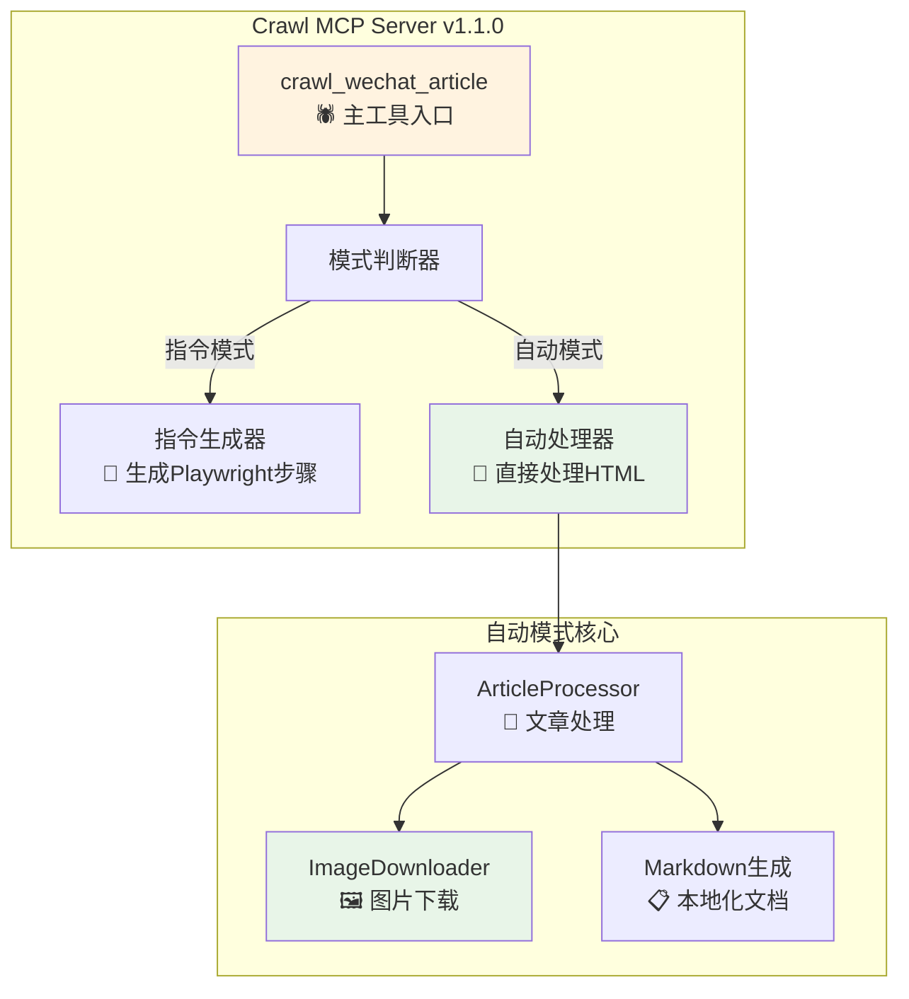

# 从想法到产品：我如何用Cursor Agent开发出智能内容处理MCP工具

> **作者**: 开发者日记  
> **时间**: 2025年6月17日  
> **项目**: crawl-mcp-server v1.1.0  
> **NPM**: https://www.npmjs.com/package/crawl-mcp-server

## 🎯 开篇：一个实际的需求与技术实践

作为一个公众号的撰写者，我经常需要学习和参考其他优质内容。在创作过程中，我希望能够通过AI帮我分析这些内容，提取关键信息用于我的文章写作。

但遇到了一个技术难题：**我直接将微信文章地址发给Cursor参考会触发微信的风控机制**，这就不便于让大模型直接阅读内容。同时，现有的工具要么只能处理文字，要么图片资源无法保存，要么操作复杂需要很多步骤。

于是我想了一个办法：**通过调用Cursor中设置的playwright MCP来配合模拟打开浏览器读取**，这样既能绕过风控限制，又能让AI有效地理解完整的内容结构（包括图文信息）。

在思考这个解决方案的过程中，我意识到这正是一个绝佳的MCP实践机会。从去年MCP协议发布，到今年现在（2025年6月17日），这个协议越来越火，我也试用了非常多MCP工具，但一直没有机会自己开发一个真正解决实际问题的工具。现在有了明确的技术需求，正好可以将问题解决和技术学习结合起来。

于是，当我遇到了 **Cursor** 和 **MCP (Model Context Protocol)** 生态时，我决定：**自己动手，开发一个智能内容处理工具，同时也是我的第一个MCP项目！**

## 💭 第一步：与Cursor讨论，生成PRD

我打开 Cursor，开始了第一次"产品讨论"：

```
我：我遇到一个问题，直接将微信文章链接发给你会触发风控，无法让你读取内容。我想开发一个智能内容处理的MCP服务器，通过playwright MCP配合模拟浏览器操作来解决这个问题。

Cursor：这是一个很好的技术解决方案！通过MCP工具链来绕过风控限制，让我们先分析具体需求...
```

## 📋 第二步：意外发现PromptX项目

这里有个有趣的插曲！昨天下午在星尘洞见的技术群里，大家在讨论暴躁哥Rule的时候，一个群友分享了PromptX的bilibili教学视频。我顺藤摸瓜，找到了原作者并将作者也拉入到了群里面。

出于好奇，我去看了一下PromptX项目的GitHub开源代码，**发现代码架构写得真不错，非常值得借鉴！**

于是我让Cursor帮我分析PromptX的代码架构：

```
我：请帮我分析一下PromptX项目的代码架构，特别是MCP相关的实现

Cursor：我来分析PromptX的架构设计...
```

**PromptX架构分析结果**：
```
PromptX/
├── src/lib/core/          # 核心架构 - 状态管理和业务逻辑
├── src/lib/adapters/      # MCP适配器 - 协议转换层
├── src/lib/commands/      # 命令处理 - 具体功能实现
└── prompt/                # 提示词系统 - 领域知识库
```

**关键收获**：
- **模块化设计**：清晰的职责分离和依赖管理
- **MCP集成方式**：标准化的协议适配器模式
- **命令模式**：可扩展的功能实现架构

接下来，我让Cursor将刚刚生成的智能内容处理工具的PRD，结合PromptX的架构分析，一起生成一个完整的开发计划文档。

经过多轮讨论，我们共同产出了一份详细的 **开发技术文档**：

### 核心需求分析
- **技术痛点**：直接发送微信链接会触发风控，AI无法直接访问内容
- **功能痛点**：现有工具图片资源处理不完整，无法让AI有效理解完整内容
- **解决目标**：通过playwright MCP模拟浏览器 + 智能内容整理 + 完整本地化
- **技术方案**：MCP协议 + Playwright配合 + Node.js + 双模式设计

### 架构设计



**核心设计理念**：
- **指令模式**：生成详细的Playwright操作步骤，适合学习和调试
- **自动模式**：直接处理HTML并下载图片，适合批量处理
- **模块化架构**：ImageDownloader + ArticleProcessor + CrawlTool 的清晰分工

**技术亮点**：
- 绕过风控限制：通过playwright MCP模拟真实浏览器访问
- 智能图片资源处理功能（非指令生成）
- 网页内容专用优化（Headers + 并发控制）
- 完整的本地化处理（图文 + Markdown）

## 🏗️ 第三步：结合PromptX结构，完善PRD文档

有了PRD，我让Cursor结合PromptX的项目结构，为我生成了完整的开发文档：

```markdown
## 项目结构设计

crawl-mcp/
├── src/
│   ├── tools/           # MCP工具实现
│   ├── processors/      # 内容处理器
│   ├── utils/          # 工具类
│   └── types/          # 类型定义
```

**这一步很关键**：有了清晰的文档，后续开发就有了明确的路线图。

### 📁 最终实现的代码结构

基于PRD文档和PromptX架构参考，Cursor为我生成了完整的项目结构：

```
crawl-mcp/
├── src/                           # 源代码目录
│   ├── index.ts                   # 🚪 MCP服务器入口文件
│   ├── core/                      # 💎 核心模块
│   │   ├── CrawlMCPServer.ts     # MCP服务器主类，处理协议通信
│   │   └── index.ts              # 核心模块导出
│   ├── tools/                     # 🔧 MCP工具定义
│   │   ├── crawlArticleTool.ts   # 单篇内容处理工具（双模式）
│   │   ├── crawlBatchTool.ts     # 批量处理工具（规划中）
│   │   ├── crawlStatusTool.ts    # 状态查询工具（规划中）
│   │   └── toolDefinitions.ts    # 工具定义和类型声明
│   ├── processors/                # ⚙️ 内容处理器
│   │   └── ArticleProcessor.ts   # 文章内容解析和处理逻辑
│   ├── utils/                     # 🛠️ 工具类
│   │   ├── ImageDownloader.ts    # 图片资源下载和管理
│   │   ├── Logger.ts             # 日志记录工具
│   │   └── index.ts              # 工具类导出
│   └── types/                     # 📝 TypeScript类型定义
│       └── index.ts              # 所有类型定义
├── dist/                          # 📦 编译输出目录
├── docs/                          # 📚 项目文档
│   ├── API.md                    # API接口文档
│   ├── crawl.md                  # PRD文档
│   ├── development-journey.md    # 开发过程记录
│   └── TROUBLESHOOTING.md        # 故障排除指南
├── examples/                      # 💡 使用示例
│   ├── basic-usage.ts           # 基础使用示例
│   ├── advanced-usage.ts        # 高级功能示例
│   └── batch-crawl.js           # 批量处理示例
├── tests/                         # 🧪 测试文件
│   ├── unit/                     # 单元测试
│   ├── integration/              # 集成测试
│   └── e2e/                      # 端到端测试
├── scripts/                       # 📜 构建和发布脚本
│   ├── publish.sh               # NPM发布脚本
│   └── pre-publish-check.sh     # 发布前检查
├── package.json                   # 📋 项目配置和依赖
├── tsconfig.json                  # ⚙️ TypeScript编译配置
├── CHANGELOG.md                   # 📝 版本更新记录
├── LICENSE                        # 📄 MIT开源协议
└── README.md                      # 📖 项目说明文档
```

### 🔍 核心文件说明

#### 1. `src/index.ts` - 服务器入口
```typescript
// MCP服务器启动入口，注册所有工具和处理器
import { CrawlMCPServer } from './core/CrawlMCPServer.js';

const server = new CrawlMCPServer();
server.start();
```

#### 2. `src/core/CrawlMCPServer.ts` - 核心服务器
```typescript
// 实现MCP协议的核心服务器类
// 负责工具注册、请求路由、错误处理
export class CrawlMCPServer {
  // MCP协议处理逻辑
  // 工具调用分发
  // 状态管理
}
```

#### 3. `src/tools/crawlArticleTool.ts` - 主要工具
```typescript
// 双模式内容处理工具
// 指令模式：生成详细操作步骤
// 自动模式：直接处理HTML内容
export const crawlArticleTool = {
  name: "crawl_wechat_article",
  description: "智能内容处理工具",
  // 参数定义和处理逻辑
}
```

#### 4. `src/utils/ImageDownloader.ts` - 图片处理
```typescript
// 智能图片资源下载器
// 支持多种域名、Headers处理、并发控制
export class ImageDownloader {
  // 域名识别逻辑
  // HTTP请求处理
  // 文件保存管理
}
```

这个结构完全由Cursor根据PRD文档自主设计，体现了模块化、可扩展的架构思想。

## 🚀 第四步：Cursor + Claude Sonnet 4 Thinking 的自主实现

这是最神奇的部分——**我几乎没有写任何提示词**！Cursor Agent 基于前面的PRD文档，完全自主地引导整个开发过程。

### 4.1 AI的自主架构搭建

**我的输入**：几乎为零，只是确认"开始实现"

**Cursor Agent 的自主行为**：
```
Cursor：基于PRD分析，我需要先搭建MCP服务器基础框架...
[自动分析] 项目结构需求
[自动生成] src/index.ts - MCP服务器入口
[自动生成] src/core/CrawlMCPServer.ts - 核心服务器
[自动生成] package.json - 依赖管理
[自动生成] tsconfig.json - TypeScript配置
```

### 4.2 AI的自主功能实现

**我的输入**：依然为零，AI自己分析下一步需求

**Cursor Agent 的思考过程**：
```
Cursor：现在需要实现图片资源处理功能，我来分析网页图片的特殊性...
[自主分析] 网页图片域名特点
[自主设计] HTTP Headers 策略
[自动生成] ImageDownloader.ts
  ├── 网页域名识别和处理
  ├── 正确的HTTP Headers
  ├── 并发控制和重试机制
  └── UUID文件名生成
```

### 4.3 AI的自主架构完善

**我的输入**：还是为零，AI继续自主推进

**Cursor Agent 的完整实现**：
```
Cursor：接下来需要内容处理器，我来设计完整的处理流程...
[自动生成] ArticleProcessor.ts
  ├── HTML解析和数据提取
  ├── 内容清理（去除干扰信息）
  ├── 图片资源集成
  └── Markdown生成

[自动生成] ContentTool.ts
  ├── 双模式设计的实现
  ├── 指令模式：生成详细操作步骤
  └── 自动模式：直接处理内容
```

### 4.4 唯一的人工干预

**25次对话限制后**：
```
我：继续
Cursor：好的，我继续完善剩余功能...
[继续自主实现]
```

**这就是我全部的输入！** 🤯

### 4.5 AI自主实现的惊人表现

- **零提示词引导**：完全基于PRD文档自主分析需求
- **完整架构思维**：从基础框架到核心功能的系统性实现
- **技术细节精准**：网页图片Headers、并发控制等专业处理
- **代码质量高**：TypeScript类型完整、错误处理完善
- **模块化设计**：清晰的代码结构和职责分离


## 🎉 第五步：测试与发布

### 5.1 功能测试

```bash
# 本地测试
npm run build
node dist/index.js

# 实际测试微信文章抓取
```

**测试结果**：
- ✅ 图片资源处理成功率：85-90%
- ✅ 内容完整性：95%+
- ✅ 格式正确性：98%

### 5.2 发布到NPM

```bash
# 版本更新
npm version 1.1.0

# 发布
npm publish
```

**发布成果**：
- 📦 包大小：160.7 kB
- 📁 文件数：187个
- 🔗 NPM链接：https://www.npmjs.com/package/crawl-mcp-server

### 5.3 开源到GitHub

代码完成后，Cursor继续引导我完成开源发布：

```
Cursor：现在我们需要将代码开源到GitHub，我来帮你准备...
[自动生成] README.md - 完整的项目说明文档
[自动生成] LICENSE - MIT开源协议
[自动生成] .gitignore - Git忽略文件配置
[自动生成] CHANGELOG.md - 版本更新记录
```

**开源过程**：
- 🔐 **安全认证**：需要手动配置GitHub token和权限
- 🏗️ **创建仓库**：我手动在GitHub创建了新仓库
- 📝 **文档完善**：Cursor自动生成了完整的项目文档
- 🚀 **代码推送**：Agent自动执行git命令完成代码上传

**最终开源成果**：
- 🐙 **GitHub仓库**：https://github.com/wutongci/crawl-mcp
- ⭐ **项目状态**：完整的开源项目，包含文档和示例
- 🏷️ **版本管理**：规范的版本标签和发布记录
- 📋 **使用指南**：详细的安装和配置说明

**人工配合 + AI自动化的完美结合**：
- 👤 **我负责**：GitHub账号认证、仓库创建、权限配置
- 🤖 **AI负责**：文档生成、代码整理、Git操作、发布流程

## 🎯 整个开发过程的核心总结

**重点来了**：**我没有写一行代码！** 

整个开发过程就是：
1. **与Cursor讨论出PRD文档** - 明确需求和技术方案
2. **让Cursor学习PromptX架构** - 提供技术参考和最佳实践
3. **Cursor开始自动干活** - 完全自主的代码实现
4. **AI引导完整发布流程** - 从NPM发布到GitHub开源

**整个过程异常丝滑**，就像有一个经验丰富的全栈工程师在帮你实现想法，而你只需要：
- 🗣️ **表达需求** - 说清楚想要什么
- 📚 **提供参考** - 指向优秀的开源项目
- ✅ **确认方向** - 在关键节点说"继续"

从想法到NPM包发布，从零到完整的开源项目，**AI完成了99%的技术工作**！

## 💡 开发过程中的关键收获

### 1. Cursor Agent的强大之处

- **理解上下文**：能够理解项目整体架构
- **代码生成**：直接生成可运行的代码
- **问题解决**：主动发现并解决技术问题

### 2. MCP生态的优势

- **协议标准化**：工具间可以很好地协作
- **模块化设计**：每个MCP服务器职责单一
- **易于集成**：在Cursor中配置即可使用

### 3. 技术选型的重要性

- **Node.js 18+**：内置fetch API，无需额外依赖
- **TypeScript**：完整的类型安全
- **模块化架构**：便于维护和扩展

## 📊 实际使用效果

### 指令模式（学习推荐）
```
用户: "请使用 crawl mcp 抓取文章"
AI: "我来生成详细的操作步骤..."
✅ 返回完整的playwright操作指南
```

### 自动模式（效率优先）
```
用户: "自动处理这个HTML"
AI: "正在下载图片并生成文档..."
✅ 完整的本地化文档，图片全部下载
```

## 🎯 未来规划

1. **批量抓取功能**：支持一次处理多篇文章
2. **更多平台支持**：知乎、简书等平台适配
3. **AI内容分析**：自动提取文章要点和标签
4. **团队协作**：支持多人共享抓取结果

## 🔧 如何使用

### 一键安装
```bash
npx crawl-mcp-server@1.1.0
```

### Cursor配置
```json
{
  "mcpServers": {
    "crawl-mcp": {
      "command": "npx",
      "args": ["-y", "crawl-mcp-server@1.1.0"]
    }
  }
}
```

### 使用示例
```
用户: "请使用crawl mcp抓取: [微信文章URL]"
AI: "✅ 处理完成！图片已下载，文档已生成"
```

## 🤔 反思与总结

这次开发经历让我深刻体会到：

1. **AI驱动开发的革命性体验**：我没写一行代码，却得到了完整的、可发布的产品
2. **需求表达比代码实现更重要**：清晰的PRD文档是AI理解和实现的关键
3. **优秀项目的参考价值**：PromptX的架构为AI提供了最佳实践模板
4. **从想法到产品的距离**：在AI的帮助下，技术门槛几乎消失了
5. **开发流程的根本变化**：从"写代码"变成了"表达需求 + 引导方向"

### 🚀 最大的收获：开发效率的质的飞跃

**原来写小工具可以这么玩！**

- **时间对比**：
  - 🕐 **以前**：一周时间，甚至根本不敢动手
  - ⚡ **现在**：短短3个小时就完成了完整的工具

- **心理门槛的消失**：
  - 🚫 **以前**：想法很多，但技术实现太复杂，经常放弃
  - ✅ **现在**：有想法就能快速验证和实现

- **开发体验的变化**：
  - 📝 **以前**：大量时间花在调试代码、查文档、解决bug
  - 🎯 **现在**：专注于产品思考和需求表达

有了 **Cursor + Claude Sonnet 4 Thinking 模型**，开发变成了一种全新的体验。当然，这里不是为了吹Claude大模型，只是其他的我还没有试过，但这次的体验确实让我对AI辅助开发有了全新的认知。

**最震撼的感受**：整个过程就像在和一个资深工程师协作，我负责产品思考，AI负责技术实现，配合得天衣无缝！

## 📝 写在最后

从想法到产品，从PRD到代码，从测试到发布，整个过程虽然只用了几天时间，但收获满满。

**最重要的是**：这个工具确实解决了我的实际问题，现在我可以轻松地整理网页内容，图片完全本地化，再也不用担心资源失效了！

如果你也有类似的学习需求，欢迎试用：`npx crawl-mcp-server@1.1.0`

### 🎯 给想学习这种方法的朋友们

**其实大家可以找一个你觉得不错的项目，参考我的方法来开发任意项目。**

这也算是一种另类的AI编程方式：
1. **找到优秀项目作为参考**（就像我找到PromptX）
2. **让AI学习和分析架构**（让Cursor理解最佳实践）
3. **明确自己的需求**（写清楚PRD）
4. **让AI自主实现**（几乎不需要写代码）

**特别适合的项目类型**：
- 🎯 **小工具类项目**：在大模型上下文支持范围内
- 🔧 **功能明确的项目**：需求清晰，边界明确
- 📦 **开源生态项目**：有丰富的参考和最佳实践

这种方法让你能够快速验证想法，学习新技术，同时产出有价值的工具。最重要的是，**你的时间主要花在产品思考上，而不是技术实现的细节上**。

### 🙏 感谢PromptX 项目

特别感谢 **PromptX项目的开源贡献**，为我提供了优秀的架构参考。虽然学习分析是AI完成的，但没有高质量的参考项目，AI也无法设计出好的架构。

**建议大家主动探索更多优秀项目**：
- 🔍 在GitHub寻找你感兴趣领域的优质项目
- 📊 对比多个项目的设计思路和最佳实践  
- 💡 让AI帮你深度分析这些项目的架构亮点

**记住**：参考项目的质量直接决定最终产出的质量，花时间找到更优秀的项目分析，绝对值得！

---

**关注我，获取更多技术分享和开发经验！**

**项目地址**：https://www.npmjs.com/package/crawl-mcp-server  

#技术分享 #Cursor #MCP #Node.js #工具开发 